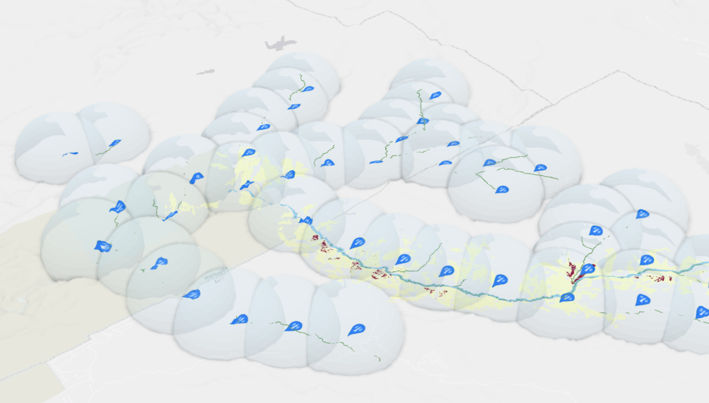
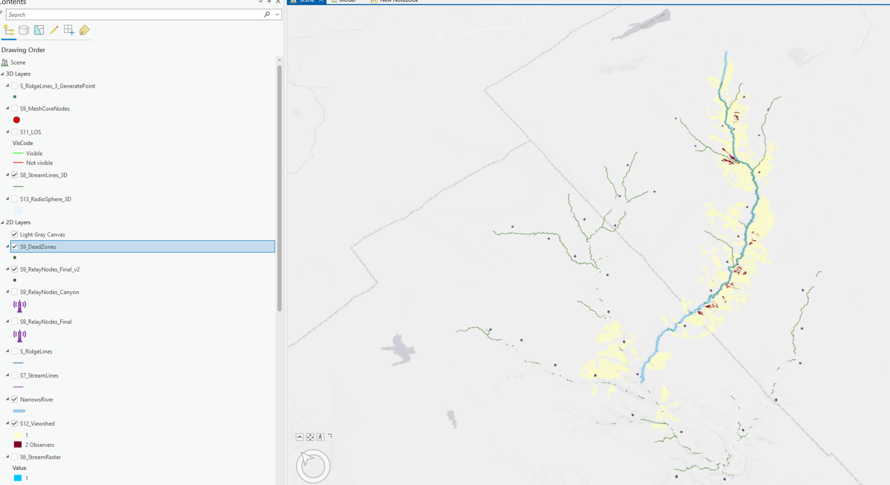
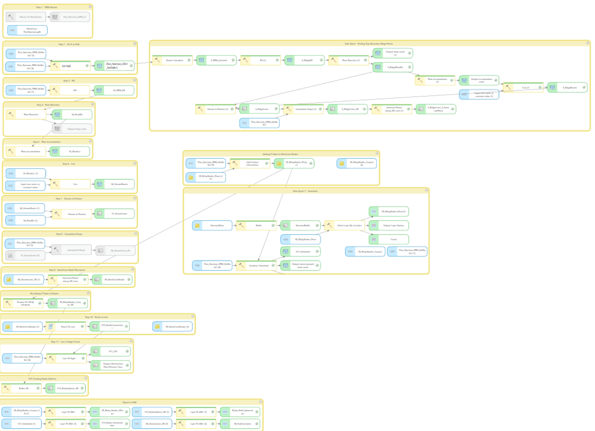
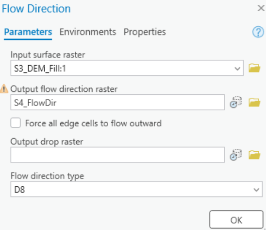
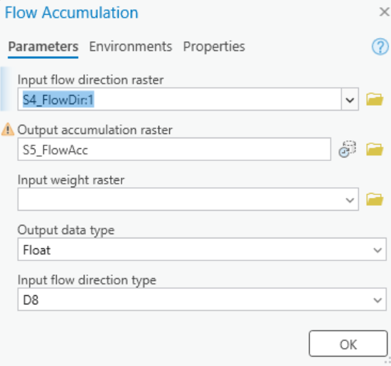
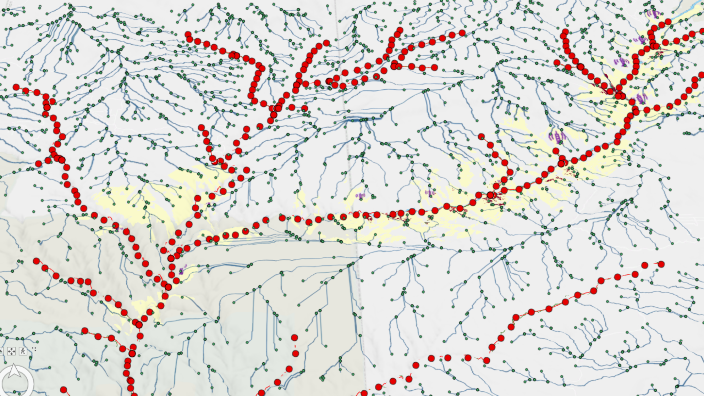
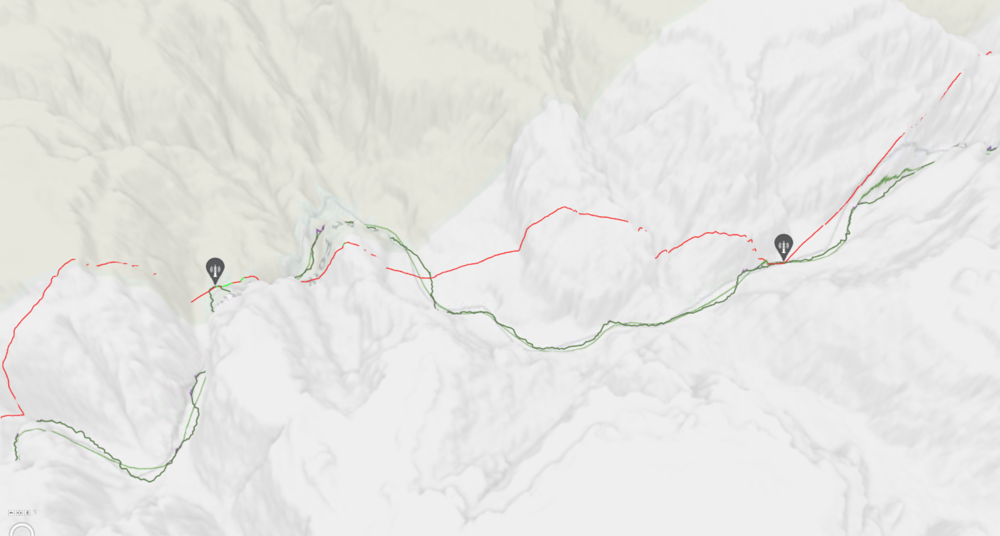
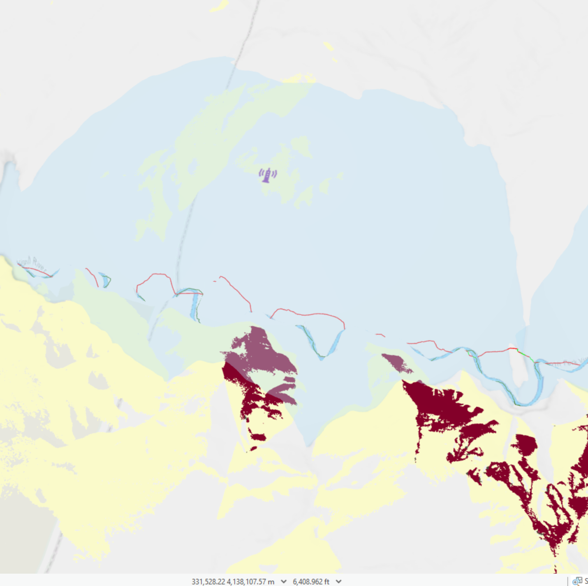
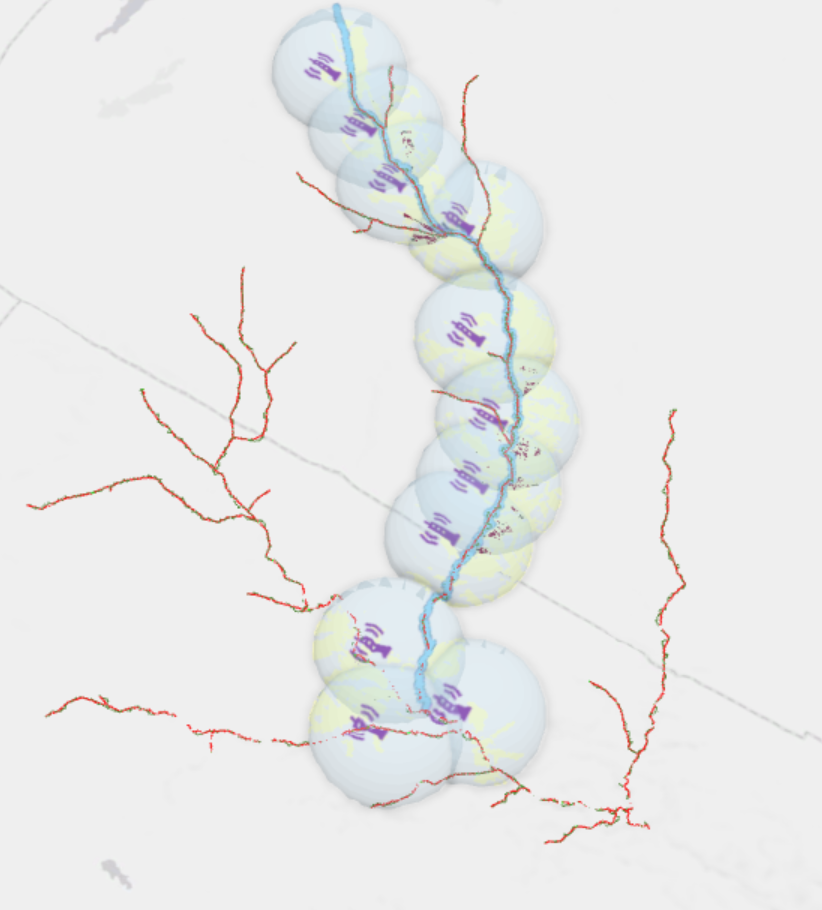

# 🏔️ MeshCore-ZionNarrows

<div align="center">



**Optimal MeshCore ridge relay node placement for emergency communication in Zion Narrows**
using 1-meter LiDAR DEMs, hydrological analysis, ridge inversion, viewshed modeling, and greedy coverage optimization in ArcGIS Pro

---


</div>

---

## 📡 Project Overview

The **Zion Narrows** is one of the most dramatic slot canyons in the United States — and one of the most communication-dead zones for hikers. With canyon walls rising over 1,000 feet and a corridor sometimes only 20 feet wide, 915MHz radio signals are almost entirely blocked by terrain between floor-level relay points.

This project answers a critical emergency planning question:

> **Where should MeshCore relay nodes be placed along the Narrows hiking route to ensure continuous mesh network coverage for emergency communication?**

The key insight from LOS analysis: **floor-level nodes fail.** Canyon walls block nearly every signal path between nodes placed on the canyon floor. The solution is **ridge-mounted relay nodes** — positioned at the highest terrain points flanking the corridor, with clear sightlines down into the canyon and across to adjacent ridges.

### 🎯 Community Deployment Goal

The final output of this project is a set of **GPS coordinates** representing optimal MeshCore relay node locations along the Zion Narrows corridor. Each coordinate represents a ridge or high point with maximum line-of-sight coverage into the canyon below.

**The intent:** The hiking community can use these coordinates as a deployment guide — hike to the location, install a solar-powered MeshCore base station, and incrementally build out emergency communication infrastructure along one of Utah's most remote and dangerous hiking corridors.

---

## 🗺️ Study Area

**Location:** Zion National Park, Utah — North Fork Virgin River  
**Corridor:** Temple of Sinawava → Chamberlain's Ranch (~16 miles)  
**Elevation Range:** 1,637m – 2,858m  
**Coordinate System:** NAD_1983_UTM_Zone_12N  

<div align="center">


*Study area showing DEM coverage and North Fork Virgin River corridor*

</div>

---

## 🏗️ Model Builder Pipeline

The analysis is built as a fully automated Model Builder workflow in ArcGIS Pro. Each step is organized in a labeled group container.

<div align="center">


*Complete automated pipeline from raw DEM tiles to MeshCore node placement*

</div>

---

## 📋 Step-by-Step Workflow

### Step 1 — Mosaic To New Raster

Merge 16 individual 1-meter DEM tiles into a single seamless elevation surface covering the full Narrows corridor.

| Parameter | Value |
|-----------|-------|
| Input Tiles | 16 USGS 1-meter GeoTIFF files |
| Output | `Zion_Narrows_DEM_v2` |
| Pixel Type | **32-bit Float** (never use 8-bit — clips elevation to 0-255) |
| Number of Bands | 1 |
| Mosaic Operator | First (ZionNP QL2 tile listed first for priority) |
| Spatial Reference | NAD_1983_UTM_Zone_12N |

<div align="center">



</div>

---

### Step 2 — Set Null (Remove NoData Zeros)

Raw mosaic tiles contain zero values in areas without coverage, causing dramatic checkerboard artifacts when rendered in 3D. Set Null replaces all zero values with proper NoData so ArcGIS falls through to the WorldElevation3D surface.

| Parameter | Value |
|-----------|-------|
| Tool | Set Null (Spatial Analyst) — NOT Image Analyst |
| Expression | `VALUE = 0` |
| Input False Raster | `Zion_Narrows_DEM_v2` |
| Output | `Zion_Narrows_DEM_NoNullv2` |

<div align="center">


*Clean 3D canyon terrain after Set Null — elevation range 1,637m to 2,858m*

</div>

---

### Step 3 — Fill

Prepare the DEM for hydrological analysis by filling sinks and pits that would interrupt flow direction calculations.

| Parameter | Value |
|-----------|-------|
| Input | `Zion_Narrows_DEM_NoNullv2` |
| Output | `S3_DEM_Fill` |
| Z Limit | blank |

---

### Step 4 — Flow Direction

Calculate the direction water flows from each cell using the D8 method — 8 possible flow directions encoded as values 1, 2, 4, 8, 16, 32, 64, 128.

| Parameter | Value |
|-----------|-------|
| Input | `S3_DEM_Fill` |
| Output | `S4_FlowDir` |
| Type | D8 |
| Force edge cells outward | unchecked |

<div align="center">


*Flow Direction raster — 8 colors represent 8 cardinal/diagonal flow directions*

</div>

---

### Step 5 — Flow Accumulation

Calculate how many upstream cells drain through each cell. Canyon floors accumulate millions of cells — this is the signature used to find drainage corridors.

| Parameter | Value |
|-----------|-------|
| Input | `S4_FlowDir` |
| Output | `S5_FlowAcc` |
| Max Value Achieved | 4.23 × 10⁸ cells |

<div align="center">


*Flow Accumulation — display with Standard Deviation stretch to see stream network*

</div>

---

### Step 6 — Con (Extract Stream Raster)

Apply a threshold to extract only cells with enough upstream drainage to represent a real canyon channel.

| Parameter | Value |
|-----------|-------|
| Expression | `VALUE > 5,000,000` |
| True Value | 1 |
| False Value | NoData |
| Output | `S6_StreamRaster` |

> **Threshold Selection:** Tested thresholds from 10,000 → 50,000 → 500,000 → 5,000,000. Final value of 5,000,000 captures main canyon channels only. Must use `is greater than` — NOT `is equal to`.

---

### Step 7 — Stream to Feature

Convert the raster stream network to vector polylines.

| Parameter | Value |
|-----------|-------|
| Input Stream Raster | `S6_StreamRaster` |
| Input Flow Direction | `S4_FlowDir` |
| Output | `S7_StreamLines` |
| Simplify Polylines | checked |

---

### Step 8 — Interpolate Shape

Add Z elevation values to the stream lines. Required because Generate Points Along 3D Lines needs Z-aware geometry, but Stream to Feature outputs 2D polylines.

| Parameter | Value |
|-----------|-------|
| Input Surface | `Zion_Narrows_DEM_NoNullv2` |
| Input Features | `S7_StreamLines` |
| Output | `S8_StreamLines_3D` |
| Method | Bilinear |
| Z Factor | 1 |

---

### Step 9 — Generate Points Along 3D Lines (Canyon Floor Nodes)

Place initial MeshCore relay node candidates at regular intervals along the canyon drainage network.

| Parameter | Value |
|-----------|-------|
| Input | `S8_StreamLines_3D` |
| Output | `S9_MeshCoreNodes` |
| Point Placement | Distance |
| Spacing | 2,000 meters |
| Include End Points | checked |
| Add Chainage Fields | checked |

<div align="center">


*Canyon floor nodes placed every 2km along the drainage network*

</div>

---

### Step 10 — Points To Line (Node Connections)

Connect consecutive nodes with line segments for Line-of-Sight analysis.

| Parameter | Value |
|-----------|-------|
| Input | `S9_MeshCoreNodes` |
| Output | `S10_NodeConnections` |
| **Line Field** | **`arcid`** |
| **Sort Field** | **`ORIG_LEN`** |
| Construction Method | Two-point line |
| Close Line | **unchecked** |

> ⚠️ **Critical:** Line Field must be `arcid` and Sort Field must be `ORIG_LEN`. Using `ORIG_FID` causes connections to jump across disconnected stream segments. Shape_Length values over ~3,000m in the output indicate incorrect sorting.

---

### Step 11 — Line Of Sight

Perform Line-of-Sight analysis between consecutive node pairs. **Result: nearly all segments blocked (red).** Canyon walls eliminate floor-level LOS across the entire corridor — this finding drives the ridge relay approach.

| Parameter | Value |
|-----------|-------|
| Input Surface | `Zion_Narrows_DEM_NoNullv2` |
| Input Lines | `S10_NodeConnections` |
| Output LOS | `S11_LOS` |
| Output Obstruction Points | `S11_ObstructionPoints` |
| Observer Height | 2 meters |
| Target Height | 2 meters |

<div align="center">


*LOS analysis — almost entirely red (blocked). Canyon walls make floor-level nodes ineffective.*

</div>

---

### Ridge Relay Pipeline (Steps R1–R8)

Since floor-level LOS fails, the analysis pivots to **ridge-mounted relay nodes**. Ridgelines are derived by inverting the DEM — peaks become valleys, so the same hydrological pipeline extracts ridge networks instead of stream networks.

#### R1 — Invert DEM (Raster Calculator)
```
"Zion_Narrows_DEM_NoNullv2" * -1
```
Output: `S_DEM_Inverted`

#### R2 — Fill Inverted DEM
Output: `S_RidgeFill`

#### R3 — Flow Direction on Inverted DEM
- Input: `S_RidgeFill`
- Output: `S_RidgeFlowDir`
- Force edge cells outward: **unchecked**

#### R4 — Flow Accumulation on Ridge Network
- Input: `S_RidgeFlowDir`
- Output: `S_RidgeFlowAcc`

#### R5 — Con (Extract Ridge Raster)
- Expression: `VALUE > 100,000` (lower threshold than streams — ridges accumulate less)
- Output: `S_RidgeRaster`

#### R6 — Stream to Feature → Ridge Lines
- Output: `S_RidgeLines`

#### R7 — Interpolate Shape → 3D Ridge Lines
- Input Surface: `Zion_Narrows_DEM_NoNullv2`
- Output: `S_RidgeLines_3D`

#### R8 — Generate Points Along 3D Lines → Ridge Nodes
- Spacing: 2,000 meters
- Output: `S_RidgeLines_3_GeneratePoint`

---

### Step 12 — Geodesic Viewshed

Calculate actual signal coverage from ridge relay nodes, accounting for terrain blockage.

| Parameter | Value |
|-----------|-------|
| Tool | Geodesic Viewshed (Spatial Analyst) — also called Viewshed 2 |
| Input Raster | `Zion_Narrows_DEM_NoNullv2` |
| Observer Features | `S9_RelayNodes_Canyon` (filtered ridge nodes) |
| Output | `S12_Viewshed_Canyon` |
| **Target Device** | **CPU only** |
| Observer Offset | 2 Meters |
| Outer Radius | 2,000 Meters |
| Outer Radius is 3D Distance | checked |
| Analysis Type | Frequency |

> **⚠️ Performance Fix — RAMDisk Required for 1m Resolution:**
> At 1-meter resolution with multiple observers, Geodesic Viewshed requires ~33GB of temporary storage and stalls repeatedly when using GPU mode or writing temp files to a standard HDD/SSD.
>
> **Fix that worked:**
> 1. Set Target Device to **CPU only** (GPU watchdog timer kills the process after ~2 mins)
> 2. Install [OSFMount](https://www.osforensics.com/tools/mount-disk-images.html) (free, by PassMark)
> 3. Create a **50GB Empty RAM Drive** → assign drive letter `R:\` → format as NTFS
> 4. Set Windows TEMP and TMP environment variables to `R:\` (via System Environment Variables GUI)
> 5. In ArcGIS Pro → Options → Raster and Imagery → set **Proxy files** to `R:\`
>
> **Result:** Temp storage dropped from 33,633MB → 17,671MB. Tool completed in **6 minutes 42 seconds** vs repeated stalls. Requires ~64GB RAM (96GB recommended for comfortable headroom).

<div align="center">


*Frequency viewshed — yellow = 1 observer, orange = 2, dark = 3+*

</div>

---

### Step 13 — Radio Sphere Buffer (3D)

Create 3D multipatch spheres representing theoretical 2km signal range around each ridge relay node.

| Parameter | Value |
|-----------|-------|
| Tool | Buffer 3D (3D Analyst) |
| Input | `S9_RelayNodes_Canyon_3D` (Z-aware points) |
| Output | `S13_RadioSphere_3D` |
| Distance | 2,000 Meters |
| Buffer Quality | 20 |

> **Note:** Buffer 3D requires Z-aware input points. Run **Add Surface Information** (output property: Z) then **Feature To 3D By Attribute** (Height Field: Z) before Buffer 3D. Skipping this step centers spheres at Z=0 (sea level).

> **Google Earth export:** Buffer 3D creates MultiPatch geometry which KML doesn't support. For Google Earth, run a standard geodesic **Buffer** (Analysis Tools) at 2,000m instead and export via Layer To KML.

<div align="center">


*3D radio spheres centered on ridge relay nodes, overlaid with viewshed coverage*

</div>

---

## 🐍 Relay Node Selector Script

A Python script runs a **greedy coverage algorithm** to select the minimum set of ridge relay nodes needed to cover all canyon floor reference nodes.

**File:** `scripts/meshcore_relay_selector_v2.py`

**Algorithm:**
1. Sort canyon floor nodes from canyon entrance (southernmost) northward
2. For each uncovered floor node, find the nearest available ridge node
3. Verify that ridge node is within `RELAY_RADIUS` meters (default: 2000m)
4. Mark all floor nodes within that ridge node's radius as covered
5. Flag unreachable floor nodes as dead zones

**Outputs:**
- `S9_RelayNodes_Final_v2` — selected relay nodes with GPS coordinates (LAT_WGS84, LON_WGS84)
- `S9_DeadZones` — canyon sections with no reachable ridge node → community deployment priorities

**Three fixes from v1:**
1. Tracks already-selected ridge node OIDs to prevent duplicate relay assignment
2. Defines canyon entrance as start node (southernmost red node by Y coordinate)
3. Verifies each floor node is actually within the relay radius before marking covered

---

## 📍 GPS Deployment Coordinates

The file `exports/RelayNodes_GPS.csv` contains the community deployment coordinates — one row per relay node with LAT/LON in WGS84.

| Field | Description |
|-------|-------------|
| NODE_ID | Sequential deployment number |
| LAT | Latitude (WGS84 decimal degrees) |
| LON | Longitude (WGS84 decimal degrees) |
| DIST_TO_FLOOR_NODE_M | Distance to nearest canyon floor reference point |

Load `exports/RelayNodes.kmz` in Google Earth or any GPS app to navigate directly to each deployment location.

---

## 📊 Data Sources

### DEM Tiles (USGS National Map)
**Download:** https://apps.nationalmap.gov/downloader/  
**Bounding Box:** Xmin=-112.9500, Xmax=-112.9000, Ymin=37.3800, Ymax=37.4700

| Tile | Project | Year |
|------|---------|------|
| x32y415_UT_ZionNP_QL2 | ZionNP | 2016 — **Primary, highest quality** |
| x32y414_UT_ZionNP_QL2 | ZionNP | 2016 |
| x33y414_UT_ZionNP_QL2 | ZionNP | 2016 |
| x32y414_UT_WashingtonCo | WashingtonCo | 2016 |
| x32y415_UT_WashingtonCo | WashingtonCo | 2016 |
| x33y414_UT_WashingtonCo | WashingtonCo | 2016 |
| x33y415_UT_WashingtonCo | WashingtonCo | 2016 |
| x34y415_UT_Southern_QL1 | Southern | 2018 |
| x32y415_UT_StatewideSouth | StatewideSouth | 2020 |
| x32y414_UT_FEMA_FlamingGorge | FEMA FlamingGorge | 2020 |
| x32y415_UT_FEMA_FlamingGorge | FEMA FlamingGorge | 2020 |
| x33y414_UT_StatewideKane | StatewideKane | 2020 |
| x33y415_UT_StatewideKane | StatewideKane | 2020 |
| x33y415_UT_FEMA_FlamingGorge | FEMA FlamingGorge | 2020 |
| x34y415_UT_StatewideKane | StatewideKane | 2020 |
| x34y415_UT_Southern_B2 | Southern | 2018 |

> **Note on FlamingGorge tiles:** The dataset name is misleading — tile coordinates x32/x33 y415 geographically cover the Zion area, not Flaming Gorge.

Direct download URLs for all tiles are in `data/dem_urls.txt`.

### River Corridor
- **Source:** OpenStreetMap via [Overpass Turbo](https://overpass-turbo.eu)
- **Feature:** North Fork Virgin River
- **Overpass Query:**
```
[out:json];
way["waterway"="river"]["name"="North Fork Virgin River"];
(._;>;);
out body;
```
Exported as GeoJSON → converted via JSON to Features tool → stored as `NarrowsRiver`

---

## 📁 Project Structure

```
MeshCore-ZionNarrows/
├── README.md
├── scripts/
│   ├── meshcore_relay_selector_v2.py   # Greedy ridge relay optimizer
│   └── meshcore_relay_selector_v1.py   # Original version (reference)
├── exports/
│   ├── RelayNodes_GPS.csv              # Community deployment coordinates
│   ├── RelayNodes.kmz                  # Google Earth deployment guide
│   ├── Viewshed.kmz                    # Signal coverage for Google Earth
│   └── NarrowsRiver.kmz               # Canyon corridor for Google Earth
├── data/
│   └── dem_urls.txt                    # Direct download URLs for all DEM tiles
├── docs/
│   └── MeshCore_ZionNarrows_Reference.docx
└── screenshots/
    ├── banner_3d_terrain.png
    ├── study_area_overview.png
    ├── model_builder_full_pipeline.png
    ├── step1_mosaic_model_builder.png
    ├── step2_clean_terrain_output.png
    ├── step4_flow_direction.png
    ├── step5_flow_accumulation.png
    ├── step9_meshcore_nodes_placed.png
    ├── step11_line_of_sight.png
    ├── step12_viewshed_canyon.png
    └── step13_radio_spheres_3d.png
```

> **Note:** The geodatabase (`.gdb`), ArcGIS project (`.aprx`), and raw DEM tiles are not included due to file size. All DEM tiles are publicly available from USGS National Map using the URLs in `data/dem_urls.txt`.

---

## 🔧 Tools Used

| Tool | Toolbox | Step |
|------|---------|------|
| Mosaic To New Raster | Data Management | 1 |
| Set Null | Spatial Analyst | 2 |
| Fill | Spatial Analyst | 3 |
| Flow Direction | Spatial Analyst | 4 |
| Flow Accumulation | Spatial Analyst | 5 |
| Con | Spatial Analyst | 6 |
| Stream to Feature | Spatial Analyst | 7 |
| Interpolate Shape | 3D Analyst | 8 |
| Generate Points Along 3D Lines | 3D Analyst | 9 |
| Points To Line | Data Management | 10 |
| Line Of Sight | 3D Analyst | 11 |
| Raster Calculator | Spatial Analyst | Ridge R1 |
| Geodesic Viewshed | Spatial Analyst | 12 |
| Buffer 3D | 3D Analyst | 13 |
| Add Surface Information | 3D Analyst | Z elevation |
| Feature To 3D By Attribute | 3D Analyst | Z geometry |
| Select by Location | Analysis | Node filtering |
| Layer To KML | Conversion | Google Earth export |

---

## 📡 Radio Specs

| Spec | Value |
|------|-------|
| Frequency | 915 MHz |
| Theoretical Range | ~2km (analysis radius) |
| Protocol | MeshCore firmware |
| Node Spacing | 2km (initial candidates) |
| Observer Height | 2m |
| Relay Type | Ridge-mounted base stations |

### Why Ridge Nodes Instead of Floor Nodes?

LOS analysis (Step 11) showed canyon walls block nearly every signal path between floor-level nodes. 915MHz radio in deep slot canyons is strictly line-of-sight — no meaningful diffraction around 300m sandstone walls. Ridge-mounted nodes at canyon rim elevation have clear sightlines down into the canyon and across to adjacent ridges, enabling a functional relay chain even through the narrowest sections.

---

## ✅ Completed Pipeline

- [x] DEM acquisition (16 tiles) and mosaic
- [x] NoData cleanup (Set Null)
- [x] Hydrological analysis (Fill → Flow Dir → Flow Acc → Con)
- [x] Stream network extraction and vectorization
- [x] Z-value interpolation on stream lines
- [x] Canyon floor node placement (2km spacing, 422 nodes)
- [x] Node connection lines (fixed: arcid + ORIG_LEN sort)
- [x] Line of Sight analysis (result: floor nodes fail — canyon walls block all LOS)
- [x] DEM inversion for ridge network extraction
- [x] Ridge hydrological pipeline (Fill → FlowDir → FlowAcc → Con → Stream to Feature)
- [x] Ridge node placement along canyon rim
- [x] Greedy relay optimizer script (v2 with 3 fixes)
- [x] Canyon corridor filtering (Select by Location within 1500m of NarrowsRiver)
- [x] Geodesic Viewshed from 11 canyon ridge relay nodes
- [x] 3D Radio Sphere buffers (Buffer 3D with Z-aware points)
- [x] GPS coordinate export (LAT_WGS84 / LON_WGS84)
- [x] Google Earth KMZ export
- [x] Dead zone identification

---

## 🎓 Academic Context

**Course:** GIS 205 — AI and Deep Learning in GIS  
**Instructor:** Prof. Walker  
**Assignment:** Final Project — 3D GIS Analysis with ArcGIS Pro

---

## 🤝 Acknowledgments

- USGS National Map for 1-meter LiDAR DEM data
- OpenStreetMap contributors for river corridor data
- ESRI for ArcGIS Pro and Model Builder
- PassMark for OSFMount (RAMDisk solution for Viewshed performance)
- Zion National Park for being an incredible study area

---

<div align="center">

**MeshCore-ZionNarrows** — *Because hikers deserve connectivity even 1,000 feet below the rim*

*The GPS coordinates in this repo are a community deployment guide. If you hike to one of these locations and install a MeshCore base station, you're building the network.*


</div>
